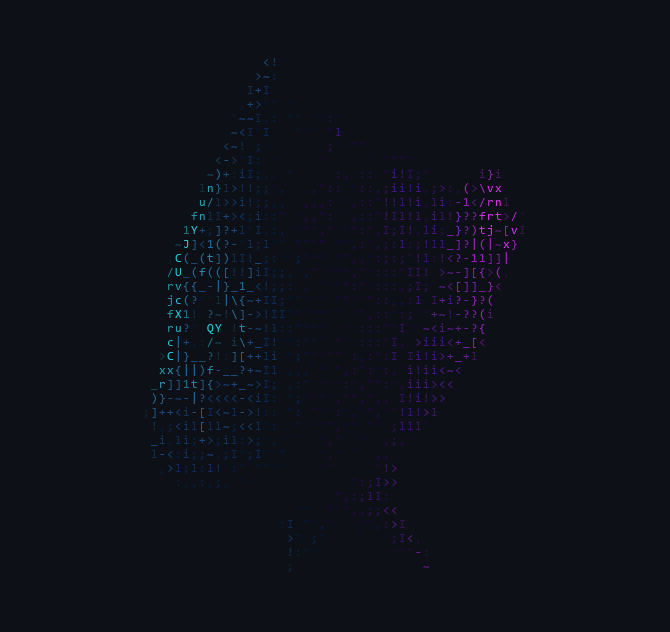

<!-- Terminal Groot Motion GIF -->

 

<!-- Motion Text / Typing Animation -->

  
  
  

---

### ⚡ What I Build

* 🚀 **Real-Time Communication:** Browser-to-browser P2P file transfers, zero-latency signaling, and WebRTC streaming channels.
* 🎧 **High-Fidelity Client Apps:** Desktop and web platforms integrated with custom audio engines, fallback parsers, and interactive 3D elements.
* 📷 **Visual & AI Systems:** Multi-modal analysis, automated image scoring matrices, and perceptual duplicate fingerprinting.

---

### 🛠️ Tech Stack & Tooling

  
  
  
  
  
  
  
  

---

### 🚀 Featured Deployments & Projects

| Project | Highlights / Core Tech | Status |
| :--- | :--- | :---: |
| **[RippleDrop](https://github.com/Midnight-Monster-Coding/RippleDrop)** | Zero-install local browser P2P transfer utilizing WebRTC data channels & fluid canvas animations. | `Active` |
| **[DarkBeats](https://github.com/Midnight-Monster-Coding/DarkBeats-Desktop)** | High-fidelity cross-platform music streaming platform featuring 3D UI states and fallback playback routing. | `Active` |
| **[Shutter Soul](https://github.com/Midnight-Monster-Coding/Shutter_Soul)** | Competitive photography platform with perceptual duplicate hashing, automated rating, and WebRTC calls. | `Active` |
| **[AI_ScannerByIAB](https://github.com/Midnight-Monster-Coding/AI_ScannerByIAB)** | Vision assistant running multi-modal OCR, math expression parsing, and edge object detection. | `Active` |

---

### 📈 Activity & Stats

  

    
    
    
  

  

